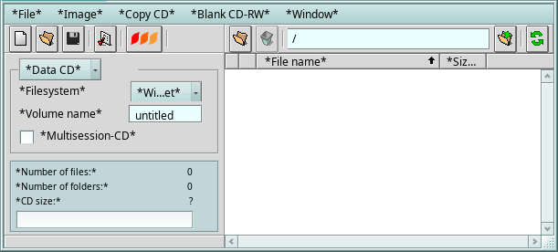

# Helios - CD Burning App for BeOS
### By Maurice Michalski, Mark Hogben

(Best viewed in Swis 721BT size 10)

Please send ALL feedback to:
leonifan@dsl.pipex.com (Mark Hogben)

Important new features in Helios 1.71b2
-----------------------------------------------------------

Language support on R5 (once again!) - includes Zeta-style translation files!!!
============================================

This has been added with a brand new language manager, and a selection menu from the Helios Settings window (Language heading). No need any more to maintain "rsrc" files for translation - only the Zeta-style ones :-)

IMPORTANT: You must restart Helios for any selection changes to take effect!!!

The language manager will, when Helios is started, automatically load all language files in the directory <helios dir>/Language/Dictionaries/ that follow the naming pattern "Helios.xxXX" where 'xx' is the language abbreviation, and 'XX' is the regional variation - (the same as for the locale files in Zeta)

e.g. US English would be written as 'enUS' and so the filename will be "Helios.enUS".

Note: If you find any untranslated strings in Helios under R5, it will now place asterisks (*) around the text, to tell you that it is not present in the current translation file. Please send translations (or updated translation files) to me at leonifan@dsl.pipex.com. (Thank you :-)

I have also added a 'enUK' file for the United Kingdom - so far only with 'colour' different from the US - but I thought it might be handy in the future!!

Burning Priority Setting (General section of Helios Settings)
==================================

This might help with some CPU usage issues for some users. IDE replacement driver will help MUCH more with this issue, however - and I have yet to release an updated "cdrtools" which might improve things further.
Note: this defaults to LOW in the menu currently - if you have burning problems, particularly with older drives (and those with no BurnProof), try setting this to HIGH.

Also:
===
- Some more minor tweaks to the code underneath (so always good to test things, and send bug reports to me!!!)
- Filesystem for new projects now defaults to Windows Joliet - filenames are better under this. However, if you have installed Helios previously the settings will stay as you last had them. If you been having CAPITALISED or truncated filenames with burns, best to change the default for new projects to Joliet.

Hope you have good experiences with this version but remember it is a Beta release. Some things may still be buggy, so PLEASE log all issues - clearly, and preferably with a step-by-step reproduction - to Mark Hogben at leonifan@dsl.pipex.com

Thanks!
Mark Hogben
(Resident maintainer of Helios)
